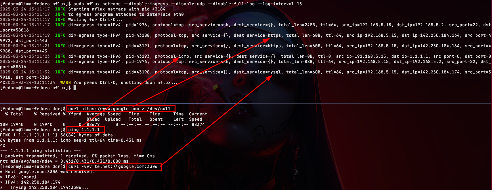
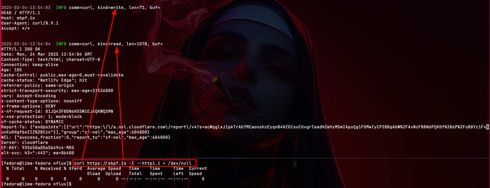

    <h1 align="center">nflux project</h1>
    
Network monitoring tool & TLS/SSL sniffer using eBPF. Powered by Aya-rs 🐝

    
Kernel and user space code written entirely in Rust ❤

---

---

_netrace example_
---

_tlstrace example_
---

# Introduction

## What is nflux?

Nflux is a **`eBPF`** tool that currently serves two purposes:

- **netrace:** monitors `incoming/outgoing` traffic on a Linux system by attaching a TC (Traffic Control) program using eBPF technology. It can be attached to both physical and virtual interfaces (wireguard), allowing us to obtain networking data at a very low level. _Supports only Ipv4 packet sniffing (Ipv6 is being implemented)_

- **tlstrace:** sniffs `read/write` traffic before it is encrypted by libraries such as OpenSSL. In other words, it allows reading data from the buffer of libraries like OpenSSL. (A simple curl command, for example, uses this library to encrypt its data before sending it to the destination). _Supports only HTTP1.1 (HTTPS2 HPACK decompression is being implemented)_

> [!NOTE]
> The code is highly improvable. I'm a rookie of eBPF, Rust, and software engineering in general.

# Installation

Read the [installation](./docs/installation.md) doc.

# Usage

Read the [usage](./docs/usage.md) doc.

# Contribution

Any improvement is welcome! If you want to help me improve in Rust and eBPF, I'd be delighted!

# License

**`nflux`** is distributed under the terms of the [AGPL3](./LICENSE) license.
