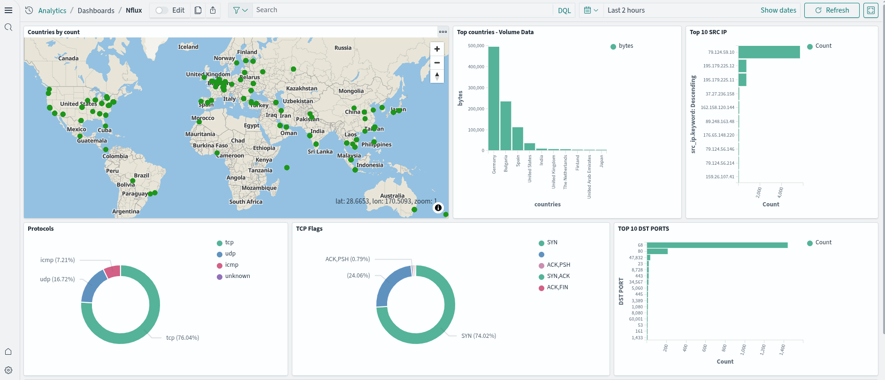

    <h1 align="center">The nflux project</h1>
    
Simple network monitoring agent tool. Powered by eBPF 🐝

    
Kernel and user space code written entirely in Rust ❤

---

    
    
    
    
    
    
    
    
    
    

---

    

---

    <h3 align="center">Build your own network monitoring dashboard with Opensearch</h3>
    

---

# What is nflux?

Nflux is an [`eBPF`](./docs/what_is_ebpf.md)-based agent tool that monitors `incoming/outgoing` traffic on a Linux system by
attaching a `XDP (Express Data Path)` program using eBPF technology. (... More coming soon!)

> [!WARNING]
I am working on a new agent-mode implementation of `nflux` that can be deployed as a `systemd` service or a Docker container. The goal is to extract network statistics (using `eBPF` and `XDP`) from any Linux server and display them on a centralized `Grafana` dashboard. Version [`0.12.7`](https://github.com/containerscrew/nflux/tree/v0.12.4) is the latest released version that uses `nflux` as a `CLI` using `TC` (Traffic Control).

# Documentation

I'm trying to move all the documentation to this new site: https://containerscrew.github.io/nflux/

# License

**`nflux`** is distributed under the terms of the [GPL3](./LICENSE-GPL3) license.
