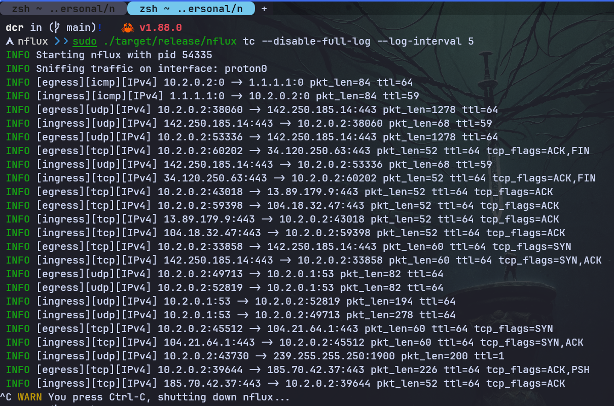
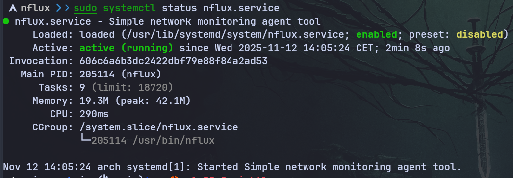

<p align="center">
    <h1 align="center">The nflux project</h1>
    <p align="center">Simple network monitoring tool. Powered by eBPF 🐝</p>
    <p align="center">Kernel and user space code written entirely in Rust ❤</p>
</p>

---


[](/LICENSE-MIT)
[](/LICENSE-GPL3)
[](https://github.com/pre-commit/pre-commit)

[](https://github.com/containerscrew/nflux/actions/workflows/test.yml)
[](https://github.com/containerscrew/nflux/actions/workflows/build.yml)
[](https://github.com/containerscrew/nflux/actions/workflows/lint.yml)
[](https://github.com/containerscrew/nflux/actions/workflows/release.yml)
[](https://github.com/containerscrew/nflux/releases/latest)
[](https://somsubhra.github.io/github-release-stats/?username=containerscrew&repository=nflux)

---

<p align="center">
    
</p>

---

<p align="center">
    
</p>

---

# What is nflux?

Nflux is an [`eBPF`](./docs/what_is_ebpf.md)-based tool that monitors `incoming/outgoing` traffic on a Linux system by
attaching a `TC (Traffic Control)` program and `XDP (Express Data Path)` program using eBPF technology. It can be attached to both physical and virtual
interfaces, allowing us to obtain networking data at a very low level.

> THe `main` branch is considered `unstable` and may contain `breaking changes`. Please use the latest `release` for a stable experience.

# Installation

_Quick installation:_

```shell
curl --proto '=https' --tlsv1.2 -sSfL https://raw.githubusercontent.com/containerscrew/nflux/main/scripts/install.sh | sh
```

Read the [installation](https://github.com/containerscrew/nflux/wiki/Installation) doc.

# Usage

```shell
sudo nflux --help
sudo nflux tc # L2/L3 monitoring
```

Read the [usage](https://github.com/containerscrew/nflux/wiki/Usage) doc for more options.

# Wiki

> [!WARNING]
> The wiki is still under construction, so some pages may not be complete or outdated.

Read the [wiki](https://github.com/containerscrew/nflux/wiki) for more information about the project.

# License

**`nflux`** is distributed under the terms of the [GPL3](./LICENSE-GPL3) and [MIT](./LICENSE-MIT) license.
