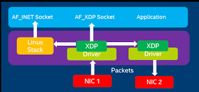
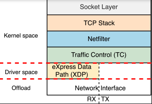

> [!WARNING]
> This tool is under development :)

> [!NOTE]
> [In this branch](https://github.com/containerscrew/nflux/tree/old-20250206) I tried to implement firewall functions using XDP, which I have now removed due to complexity given my initial knowledge of eBPF and control of TCP states (syn/ack/rst...etc) in ipv4, ipv6, among other problems. I will change the tool to be a simple cli to monitor eggress/ingress traffic using TC. As a first feature to learn how to use eBPF with Aya-rs, it is enough for someone who is learning.

<p align="center">
    <h3 align="center">nflux</h3>
    <p align="center">Network monitoring and firewall using EBPF, XDP and TC. Powered by Aya-rs</p>
    <p align="center">Built with ❤ in Rust</p>
</p>

<!-- START OF TOC !DO NOT EDIT THIS CONTENT MANUALLY-->
**Table of Contents**  *generated with [mtoc](https://github.com/containerscrew/mtoc)*
- [nflux](#nflux)
- [Running `nflux`](#running-nflux)
- [Features](#features)
- [Nflux architecture](#nflux-architecture)
- [Local development](#local-development)
- [Contribution](#contribution)
- [License](#license)
<!-- END OF TOC -->

# nflux

```bash
2025-02-06T19:54:47.766496Z  INFO Starting nflux with pid 30730
2025-02-06T19:54:47.798298Z  INFO Metrics server running at http://0.0.0.0:8080
2025-02-06T19:54:47.798299Z  WARN Failed to add clsact qdisc to interface enp0s20f0u4: Os { code: 17, kind: AlreadyExists, message: "File exists" }
2025-02-06T19:54:47.811127Z  INFO tc_egress program attached to interfaces: ["enp0s20f0u4"]
2025-02-06T19:54:47.811301Z  WARN Failed to add clsact qdisc to interface enp0s20f0u4: Os { code: 17, kind: AlreadyExists, message: "File exists" }
2025-02-06T19:54:47.820409Z  INFO tc_ingress program attached to interfaces: ["enp0s20f0u4"]
2025-02-06T19:54:47.821857Z  INFO Waiting for Ctrl-C...
2025-02-06T19:54:48.451749Z  INFO ingress protocol=udp, src_ip=192.168.0.17, dst_ip=192.168.0.255, src_port=43033, dst_port=15600
2025-02-06T19:54:49.230114Z  INFO ingress protocol=udp, src_ip=130.195.250.66, dst_ip=192.168.0.173, src_port=443, dst_port=53227
2025-02-06T19:54:49.230163Z  INFO egress protocol=icmp, src_ip=192.168.0.173, dst_ip=130.195.250.66, src_port=0, dst_port=0
2025-02-06T19:54:49.248876Z  INFO ingress protocol=udp, src_ip=192.168.0.25, dst_ip=224.0.0.251, src_port=5353, dst_port=5353
2025-02-06T19:54:50.909479Z  INFO egress protocol=udp, src_ip=192.168.0.173, dst_ip=212.166.132.192, src_port=50317, dst_port=53
2025-02-06T19:54:52.046784Z  INFO ingress protocol=udp, src_ip=192.168.0.13, dst_ip=224.0.0.251, src_port=5353, dst_port=5353
2025-02-06T19:54:52.409551Z  INFO egress protocol=udp, src_ip=192.168.0.173, dst_ip=212.166.132.96, src_port=58047, dst_port=53
2025-02-06T19:58:16.209343Z  INFO ingress protocol=icmp, src_ip=1.1.1.1, dst_ip=192.168.0.173, src_port=0, dst_port=0
```

# Running `nflux`

```bash
git clone https://github.com/containerscrew/nflux
cargo run --release --config 'target."cfg(all())".runner="sudo -E"' -- -l info -i interface
```

# Features

Pending to add...

# Nflux architecture

Look at what level it works XDP:



Powerful, right? Same for traffic control (TC).



> [!NOTE]
> nflux uses XDP for incoming packet processing (only works with physical interfaces).

# Local development

For local development, I don't use containers since the build process is slow. Visit this custom page for [`local development`](./docs/local_dev.md).

# Contribution

Any improvement is welcome! If you want to help me improve in Rust and eBPF, I'd be delighted!

# License

**`nflux`** is distributed under the terms of the [AGPL3](./LICENSE) license.
