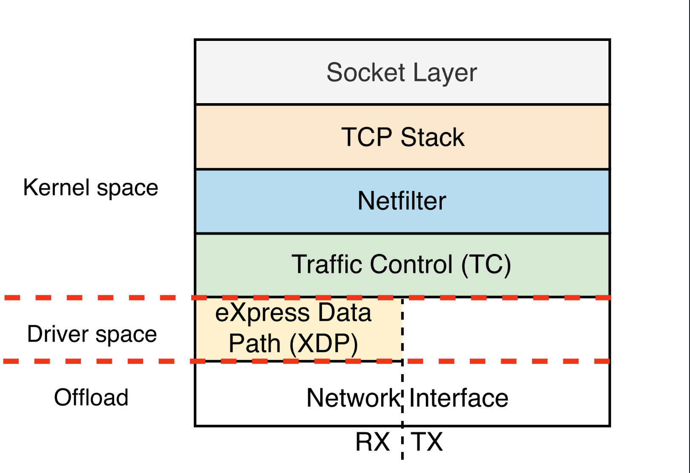

<p align="center">
    <h1 align="center">nflux project</h1>
    <p align="center">Network monitoring tool & TLS/SSL sniffer using eBPF. Powered by Aya-rs 🐝</p>
    <p align="center">Kernel and user space code written entirely in Rust ❤</p>
</p>

---

[](/LICENSE)
[](https://github.com/pre-commit/pre-commit)


[](https://github.com/containerscrew/nflux/actions/workflows/test.yml)
[](https://github.com/containerscrew/nflux/actions/workflows/build.yml)
---

<!-- START OF TOC !DO NOT EDIT THIS CONTENT MANUALLY-->
**Table of Contents**  *generated with [mtoc](https://github.com/containerscrew/mtoc)*
- [Introduction](#introduction)
  - [What is nflux?](#what-is-nflux)
  - [What is ebpf?](#what-is-ebpf)
- [Compatibility](#compatibility)
- [Installation](#installation)
- [Usage](#usage)
  - [netrace](#netrace)
    - [Changing default interface](#changing-default-interface)
    - [Sniffing (only) egress traffic](#sniffing-only-egress-traffic)
    - [Sniffing (only) ingress traffic](#sniffing-only-ingress-traffic)
    - [Packet logging](#packet-logging)
    - [Available procotols](#available-procotols)
    - [Example using netrace](#example-using-netrace)
  - [tlstrace](#tlstrace)
    - [Example using tlstrace](#example-using-tlstrace)
- [Docs](#docs)
- [Contribution](#contribution)
- [License](#license)
<!-- END OF TOC -->

```shell
$ nflux --help

    ███╗   ██╗███████╗██╗     ██╗   ██╗██╗  ██╗
    ████╗  ██║██╔════╝██║     ██║   ██║╚██╗██╔╝
    ██╔██╗ ██║█████╗  ██║     ██║   ██║ ╚███╔╝
    ██║╚██╗██║██╔══╝  ██║     ██║   ██║ ██╔██╗
    ██║ ╚████║██║     ███████╗╚██████╔╝██╔╝ ██╗
    ╚═╝  ╚═══╝╚═╝     ╚══════╝ ╚═════╝ ╚═╝  ╚═╝


Network monitoring tool & TLS/SSL sniffer using eBPF. Powered by Aya-rs 🐝.
Author: github.com/containerscrew

Usage: nflux [OPTIONS] [COMMAND]

Commands:
  netrace   Start network traffic monitoring using TC (Traffic Control)
  tlstrace  Sniffing TLS/SSL traffic using uprobes/uretprobes. Supports openssl
  help      Print this message or the help of the given subcommand(s)

Options:
  -l, --log-level <LOG_LEVEL>    Log level for logging tracing. Possible values: info, warn, trace, debug, error. [default: info]
      --log-format <LOG_FORMAT>  Log format for logging tracing. Possible values: text, json. [default: text]
  -h, --help                     Print help
  -V, --version                  Print version
```

# Introduction

## What is nflux?

Nflux is... (pending to finish)


> [!NOTE]
> The code is highly improvable. I'm a rookie of eBPF, Rust, and software engineering in general.

## What is ebpf?

_(Small intro)_

eBPF, which stands for [`Extended Berkeley Packet Filter`](https://ebpf.io/), is a revolutionary technology that allows for the dynamic insertion of small programs into various points in the kernel without requiring recompilation or modification of the kernel itself. These programs are executed in a restricted virtual machine (VM) environment directly within the kernel, providing the ability to intercept and modify data as it traverses the system. eBPF is utilized for tracing network packets, implementing firewall and network filtering programs, security software, and facilitating system monitoring.


*Source: [ebpf.io](https://ebpf.io/what-is-ebpf/)*

If you'd like to learn more about eBPF, here are some online resources and favorite books to help you continue learning:

- [ebpf.io](https://ebpf.io/)
- [eBPF official documentary](https://www.youtube.com/watch?v=Wb_vD3XZYOA&t=294s)
- [Interesting tutorials by eunomia-bpf](https://eunomia.dev/)
- [Learning eBPF by Liz Rice (Book)](https://isovalent.com/books/learning-ebpf/)
- [BCC project with a lot of useful tools and examples](https://github.com/iovisor/bcc)
- [Linux Observability with BPF by David Calavera, Lorenzo Fontana (Book)](https://www.oreilly.com/library/view/linux-observability-with/9781492050193/)

> There are many more interesting links and articles on the internet as the community grows.

# Compatibility

**Nflux has been created and tested in:**

|   OS    | ARM64 | AMD64 | Kernel version |
|---------|------|------|------|
| fedora linux   | ✅    | ✅  |`6.13.7-200.fc41.x86_64 ` |

> For example, in Debian12 with kernel version `6.1.0-31-amd64` nflux doest not works. Probably for the version of kernel bpf implementation.

# Installation

```shell
XXXXXX pending
```

# Usage

Global flags:

```shell
sudo nflux --help
sudo nflux --log-level warn
sudo nflux --log-format json
sudo nflux netrace --help
sudo nflux tlstrace --help
```

Then:

```shell
sudo nflux netrace FLAGS
# Or
sudo nflux tlstrace FLAGS
```

## netrace

> [!WARNING]
> By the moment, `nflux netrace` only supports Ipv4 sniffing

By default, everything is enabled. Which means:

- Egress traffic
- Ingress traffic
- UDP/TCP/ICMP protocols
- Full packet logging

Let's see in the following sections how to customize `nflux netrace`.

Look at what level XDP and TC work:



### Changing default interface

The program automatically detects your default iface.

```shell
sudo nflux netrace -i eth0
```

### Sniffing (only) egress traffic

```shell
sudo nflux netrace --disable-ingress
```

### Sniffing (only) ingress traffic

```shell
sudo nflux netrace --enable-egress
```

### Packet logging

By default `nflux netrace` will log **all packets** (egress/ingress) entering the NIC (Network Interface). If you use `--disable-full-log`, you can use `--log-interval` to set the time interval in which the same `ip->port` connection will be logged.

For example:

```shell
ping 1.1.1.1
```

Every packet of type `icmp` to the ip `1.1.1.1` will be logged in the terminal.

Or:

```shell
curl http://external-ip
```

So, if you don't want to log every packet, you can should run the command:

```shell
sudo nlux netrace --disable-full-log # default to 5 seconds
```

Or you can also change the `--log-interval`:

```shell
sudo nflux netrace --disable-full-log --log-inveral 3 # every 3 seconds
```

### Available procotols

`UDP/TCP/ICMP` available by default.

To disable protocols like `udp`, `icmp`, `tcp`:

```shell
sudo nflux netrace --disable-udp --disable-icmp --disable-tcp
```

### Example using netrace

_TODO: GIF example_

## tlstrace

> [!WARNING]
> By the moment, `nflux tlstrace` only supports SSL/TLS sniffing for protocol HTTP1.1
> `HTTP2` is being implemented, trying to decrypt HPACK compression.

```shell
+-----------------------------------------------+
|                 Application                   |
|      (e.g. Web Browser, Client Software)      |
+--------------------+--------------------------+
|      write()      |         read()            |
|        ↓          |          ↑                |
+--------------------+--------------------------+
|                TLS Library                    |
|       (e.g., libssl.so, OpenSSL)              |
+--------------------+--------------------------+
|     SSL_write()   |       SSL_read()          |
|        ↓          |          ↑                |
+--------------------+--------------------------+
|              Linux Kernel                     |
+--------------------+--------------------------+
|      send()       |         recv()            |
|        ↓          |          ↑                |
+-----------------------------------------------+
```

`tlstrace` implementations:

- Openssl ✅
- NSS ❌
- Boring SSL ❌

### Openssl

Before running `tlstrace` run the following command:

```shell
$ ldconfig -p | grep libssl
        libssl3.so (libc6,x86-64) => /lib64/libssl3.so
        libssl3.so (libc6) => /lib/libssl3.so
        libssl.so.3 (libc6,x86-64) => /lib64/libssl.so.3
        libssl.so.3 (libc6) => /lib/libssl.so.3
        libssl.so (libc6,x86-64) => /lib64/libssl.so
```

In this previous command, `/lib64/libssl.so.3` is the library that `tlstrace` needs for my fedora machine. The path changes depending on your distro.

```shell
sudo nflux tlstrace --openssl-path '/lib64/libssl.so.3'
```

### Example using tlstrace

`curl` uses openssl by default to encrypt/decrypt the data it sends.

```shell
$ curl -V

curl 8.9.1 (x86_64-redhat-linux-gnu) libcurl/8.9.1 OpenSSL/3.2.4 zlib/1.3.1.zlib-ng libidn2/2.3.8 nghttp2/1.62.1
Release-Date: 2024-07-31
Protocols: file ftp ftps http https ipfs ipns
Features: alt-svc AsynchDNS GSS-API HSTS HTTP2 HTTPS-proxy IDN IPv6 Kerberos Largefile libz SPNEGO SSL threadsafe UnixSockets
```

Run the following command:

```shell
curl https://iproxy.containerscrew.com/me --http1.1
```

> curl without specifying --http1.1 uses http2. In the log you will see data encrypted with the HPACK algorithm.


_TODO: GIF example_

# Docs

More documentation inside [`docs`](./docs/) folder:

- Todo and features
- Local development
- Old nflux

# Contribution

Any improvement is welcome! If you want to help me improve in Rust and eBPF, I'd be delighted!

# License

**`nflux`** is distributed under the terms of the [AGPL3](./LICENSE) license.
