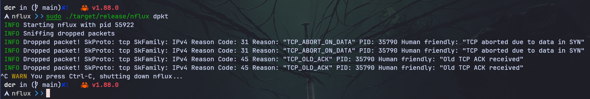

    
    <h1 align="center">The nflux project</h1>
    
Simple network monitoring agent tool. Powered by eBPF 🐝

    
Kernel and user space code written entirely in Rust ❤

---

    
    
    
    
    
    
    
    
    
    

---

    <h3 align="center">Monitor incoming traffic using XDP</h3>
    

---

    <h3 align="center">Nflux managed by systemd service (in future versions will be contiainerized)</h3>
    

---

    <h3 align="center">Build your own network monitoring dashboard with Opensearch</h3>
    

---

# What is nflux?

Nflux is a network agent tool that monitors `incoming` traffic on a Linux system by
attaching a `XDP (Express Data Path)` program using eBPF technology.

# Features

To be added...

# Documentation

Documentation still in progress, but will be available soon in https://nflux.containerscrew.com

# License

**`nflux`** is distributed under the terms of the [GPL3](./LICENSE-GPL3) license.
