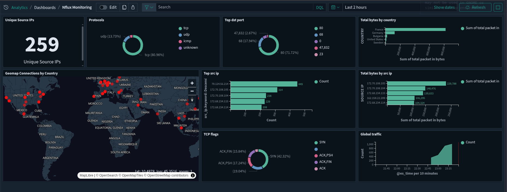

Introduction
===================

Nflux is a network agent tool that monitors `incoming` traffic on a Linux system by
attaching a `XDP (Express Data Path)` program using eBPF technology.

The nflux program attaches directly to the physical network interface, enabling packet processing at a very low level, right at the network driver. It supports both `IPv4` and `IPv6` packet processing, as well as core protocols such as `TCP`, `UDP`, and `ICMP`.

XDP can be used to redirect packets or drop them at the network interface. However, this software is not designed to act as a firewall or to redirect packets at this time. Its sole purpose is to monitor incoming traffic, allowing all packets to pass through without interference. `Multiple attachment` to different interfaces is not yet supported.

Egress traffic monitoring was available in earlier versions of nflux (prior to ``1.0.0``). For versions ``1.0.0`` and above, it is currently not included,
as the main focus of this software is tracking incoming connections.

Visualizations
--------------

Monitor incoming traffic using XDP and eBPF with nflux, a high-performance network monitoring agent.

.. image:: _static/example.png
   :alt: example image
   :align: center

Nflux managed by systemd service (in future versions will be contiainerized)

.. image:: _static/example2.png
   :alt: example systemd
   :align: center

Build your own network monitoring dashboard with Opensearch

